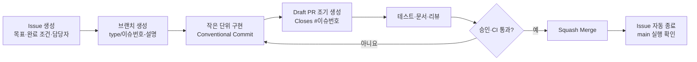

# 고객 이탈 예측 프로젝트 — GitHub 협업 규칙

> 발표: 2026-07-22  
> 운영 방식: **GitHub Flow + Issue 중심 + 짧은 기능 브랜치 + Pull Request 검토**

## 0. 한눈에 보는 협업 흐름



| 구분 | 팀 규칙 |
|---|---|
| 기준 브랜치 | `main` — 항상 실행 가능해야 하며 직접 push 금지 |
| 작업 시작 | 반드시 Issue를 먼저 만들고 담당자·검토자·완료 조건 지정 |
| 작업 브랜치 | `type/이슈번호-short-description` |
| 작업 크기 | 가능하면 반나절~1일 안에 리뷰 가능한 크기 |
| Commit | `type(scope): 요약` — 한 커밋에는 한 가지 목적만 |
| Pull Request | Issue 연결, 실행/검증 결과 첨부, 최소 1명 승인 |
| Merge | `Squash and merge`를 기본값으로 사용 |
| 동기화 | 작업 시작 전과 PR 직전 `main` 최신화 |
| 보안 | 비밀키·개인정보·대용량 원본 데이터·가상환경 커밋 금지 |

---

## 1. 저장소 최초 설정

### 권장 파일

```text
project/
├── .github/
│   ├── ISSUE_TEMPLATE/
│   │   ├── task.yml
│   │   ├── experiment.yml
│   │   └── bug.yml
│   ├── pull_request_template.md
│   └── workflows/ci.yml
├── docs/
├── data/
│   ├── raw/.gitkeep
│   ├── interim/.gitkeep
│   └── processed/.gitkeep
├── notebooks/
├── src/
├── streamlit_app/
├── tests/
├── .env.example
├── .gitignore
├── CONTRIBUTING.md
├── README.md
└── requirements.txt
```

### `main` 보호 규칙

GitHub의 Branch protection 또는 Ruleset에서 다음을 적용한다.

- Pull Request를 통해서만 병합
- 승인 최소 1명
- 리뷰 대화가 모두 해결되어야 병합 가능
- CI 상태 검사 통과 필수
- 강제 push 및 브랜치 삭제 금지
- 병합 후 작업 브랜치 자동 삭제
- 관리자도 가능한 한 같은 규칙 적용

### 저장소 옵션

- Merge 방식은 **Squash merge만 허용**
- Issue, Projects, Discussions가 필요하면 활성화
- 비밀값은 GitHub Secrets 또는 로컬 `.env`로 관리
- 모델·데이터가 GitHub 용량에 부적합하면 릴리스/외부 저장소를 사용하고 README에 획득 방법 기록

---

## 2. Issue 운영

### Issue를 만드는 기준

다음 중 하나면 Issue로 만든다.

- 30분 이상 걸릴 것으로 예상되는 작업
- 다른 팀원의 검토·결정이 필요한 작업
- 모델 실험처럼 결과와 근거를 남겨야 하는 작업
- 버그, 문서 변경, 리팩터링, 발표 준비

단순 오탈자처럼 10분 이내의 독립 수정은 가까운 Issue에 포함할 수 있다.

### Issue 제목

```text
[영역] 동사로 시작하는 구체적인 결과물
```

예시:

```text
[Data] 원본 데이터 품질 검증 및 Data Card 작성
[EDA] 이탈 여부별 핵심 특성 시각화
[Model] Logistic Regression 기준 모델 구축
[Model] Validation 기준 threshold 결정
[App] 저장 모델을 사용하는 개별 고객 예측 화면 구현
[Docs] 발표 자료에 최종 Test 결과 반영
[Bug] 앱의 범주형 입력 순서 불일치 수정
```

### Issue 본문 템플릿

```markdown
## 목적
이 작업이 필요한 이유와 기대 결과를 1~3문장으로 작성합니다.

## 작업 내용
- [ ] 구현 또는 분석 항목 1
- [ ] 구현 또는 분석 항목 2
- [ ] 문서 또는 테스트 반영

## 완료 조건 (Definition of Done)
- [ ] 산출물이 저장소에 반영되어 있다.
- [ ] 재현 또는 실행 방법이 기록되어 있다.
- [ ] 관련 테스트/검증을 통과했다.
- [ ] 데이터 누수와 비밀정보 포함 여부를 확인했다.

## 산출물
- 변경 예정 파일 또는 결과물:

## 참고
- 선행 Issue, 데이터 출처, 관련 문서:
```

### 모델 실험 Issue 추가 항목

```markdown
## 가설

## 고정 조건
- 데이터 버전:
- Train/Validation/Test 분할:
- 전처리 Pipeline:
- 주요 평가 지표:

## 변경 변수

## 결과
| 실험 | Recall | Precision | F1 | PR-AUC | 비고 |
|---|---:|---:|---:|---:|---|

## 결론
- 채택/기각:
- 근거:
- 후속 Issue:
```

### 권장 Label

Label은 **종류 1개 + 영역 1개 + 필요 시 우선순위 1개**만 붙인다.

| 분류 | Label | 의미 |
|---|---|---|
| 종류 | `type:feature` | 새 기능·분석 |
| 종류 | `type:bug` | 오류 수정 |
| 종류 | `type:experiment` | 모델·Feature 실험 |
| 종류 | `type:docs` | README·보고서·발표자료 |
| 종류 | `type:chore` | 환경·CI·정리 |
| 영역 | `area:data` | 수집·검증·전처리 |
| 영역 | `area:eda` | 탐색·시각화 |
| 영역 | `area:model` | 학습·평가·추론 |
| 영역 | `area:app` | Streamlit |
| 영역 | `area:docs` | 문서·발표 |
| 우선순위 | `priority:P0` | 오늘 반드시 해결해야 하는 차단 문제 |
| 우선순위 | `priority:P1` | 발표 전 필수 |
| 우선순위 | `priority:P2` | 시간 여유가 있으면 수행 |
| 상태 | `status:blocked` | 외부 의존성 때문에 진행 불가 |
| 상태 | `needs:decision` | 팀 결정 필요 |

### Milestone

마감이 짧으므로 Milestone을 과도하게 나누지 않는다.

| Milestone | 완료 조건 |
|---|---|
| `M1 데이터·기준선` | 요구사항, Data Card, EDA, 분할, 기준 모델 |
| `M2 모델·앱 통합` | 최종 후보, threshold, 저장/재로딩, Streamlit |
| `M3 발표 준비` | Test 최종 평가, README, 보고서, 발표자료, 리허설 |

### 담당 체계

각 Issue에 다음을 지정한다.

- **Assignee 1명:** 작업 완료 책임자
- **Reviewer 1명:** 결과·재현성·누수 여부 확인자
- 공동 작업이 필요하면 체크리스트로 담당 범위를 나눈다.

---

## 3. Branch 관리

### 전략

장기 `develop` 브랜치 없이 `main`에서 짧은 작업 브랜치를 만드는 **GitHub Flow**를 사용한다. 일정이 짧은 프로젝트에서는 병합 단계를 줄이고 충돌을 작게 유지하기 쉽다.

### 네이밍

```text
type/이슈번호-short-kebab-description
```

| Type | 용도 | 예시 |
|---|---|---|
| `feat` | 기능·분석 추가 | `feat/21-churn-eda` |
| `fix` | 버그 수정 | `fix/37-feature-order` |
| `exp` | 독립 모델 실험 | `exp/28-catboost-baseline` |
| `docs` | 문서·발표 | `docs/42-update-readme` |
| `refactor` | 동작 변경 없는 구조 개선 | `refactor/31-predict-api` |
| `test` | 테스트 추가·수정 | `test/35-inference-test` |
| `chore` | 설정·의존성·CI | `chore/5-add-ci` |

규칙:

- 영문 소문자와 숫자, 하이픈만 사용
- 브랜치 하나는 Issue 하나를 원칙으로 함
- `eda-final`, `test2`, `minsu-branch`처럼 목적이 모호한 이름 금지
- 병합된 브랜치를 재사용하지 않음
- 동일 파일을 여러 브랜치에서 대규모로 동시에 수정하지 않음

### 기본 명령

```bash
# 작업 시작
git switch main
git pull --ff-only origin main
git switch -c feat/21-churn-eda

# 변경 확인 및 커밋
git status
git diff
git add <변경한-파일>
git commit -m "feat(eda): 이탈 여부별 핵심 분포 시각화"

# 원격에 올리고 PR 생성
git push -u origin feat/21-churn-eda

# main 최신화가 필요할 때
git fetch origin
git rebase origin/main
git push --force-with-lease
```

`--force-with-lease`는 **개인 작업 브랜치의 rebase 후에만** 사용한다. 공동 사용 브랜치와 `main`에는 사용하지 않는다.

---

## 4. Commit 메시지

### 형식

```text
type(scope): 50자 안팎의 명령형 요약

필요한 경우 변경 이유와 주의점을 본문에 작성

Refs #이슈번호
```

### Type과 Scope

| Type | 의미 | 자주 쓰는 Scope |
|---|---|---|
| `feat` | 사용자 또는 분석 기능 추가 | `data`, `eda`, `feature`, `model`, `app` |
| `fix` | 잘못된 동작 수정 | `pipeline`, `predict`, `app` |
| `exp` | 실험 추가·변경 | `model`, `threshold`, `feature` |
| `docs` | 문서만 변경 | `readme`, `report`, `slides` |
| `test` | 테스트 | `inference`, `data` |
| `refactor` | 동작 유지 구조 개선 | `pipeline`, `predict` |
| `chore` | 설정·의존성·정리 | `deps`, `ci`, `git` |
| `style` | 코드 의미 없는 형식 변경 | `format` |

좋은 예:

```text
feat(data): 고객 단위 학습 테이블 생성
exp(model): Logistic Regression 기준 성능 기록
fix(predict): 학습 시점과 범주형 컬럼 순서 일치
test(inference): 저장 모델 재로딩 예측 검증 추가
docs(readme): Streamlit 실행 명령과 화면 예시 추가
```

피해야 할 예:

```text
수정
최종
진짜최종
코드 추가
오류 해결
```

### 커밋 단위

- 코드·테스트·관련 문서는 함께 커밋 가능
- 서로 되돌려야 할 가능성이 있는 변경은 별도 커밋
- 자동 생성 파일, 불필요한 노트북 출력, 개인 설정은 제외
- 커밋 전 `git diff --staged`로 포함 내용을 확인

---

## 5. Pull Request

### PR 원칙

- 작업 초기에 **Draft PR**을 만들면 진행 상황과 충돌을 빨리 공유할 수 있다.
- 한 PR은 한 목적만 다룬다.
- 리뷰가 어려울 정도로 커지기 전에 나눈다.
- PR 작성자가 셀프 체크 후 리뷰를 요청한다.
- 최종 결과 수치가 바뀌면 코드뿐 아니라 `metrics.csv`, 보고서, README도 일치시킨다.

### PR 제목

Commit과 같은 형식을 사용한다.

```text
feat(model): 고객 이탈 기준 모델 구축
```

### PR 본문 템플릿

```markdown
## 관련 Issue
Closes #번호

## 변경 내용
- 

## 변경 이유
- 

## 검증
- [ ] 로컬 테스트 통과
- [ ] 새 프로세스에서 저장 모델 로드 및 예측 확인
- [ ] Streamlit 실행 확인(해당 시)
- [ ] 데이터 누수 가능성 확인
- [ ] README/보고서/지표 파일 동기화

## 결과
- 실행 명령:
- 핵심 지표 또는 로그:
- 화면 변경 시 스크린샷:

## 리뷰 요청 사항
- 특히 확인해 주었으면 하는 부분:
```

### 리뷰 체크리스트

일반:

- Issue의 완료 조건을 충족하는가?
- 코드가 프로젝트 루트 기준 상대경로를 사용하는가?
- 함수·파일 책임이 명확하고 재실행 가능한가?
- 불필요한 파일, 비밀정보, 개인정보가 없는가?
- 오류 메시지와 예외 처리가 이해 가능한가?

ML 프로젝트 필수:

- Target과 예측 시점이 명확한가?
- 미래·사후 정보가 Feature에 포함되지 않았는가?
- 데이터 분리 후 전처리기를 Train에만 `fit`했는가?
- SMOTE가 CV 학습 fold 안에서만 수행되는가?
- Validation으로 모델·파라미터·threshold를 선택했는가?
- Test를 최종 1회 평가에만 사용했는가?
- 학습과 추론의 Feature 이름·순서·자료형이 같은가?
- 모델, 전처리기, threshold, 메타데이터가 함께 저장되는가?

### 리뷰 표현

```text
[필수] 병합 전 반드시 수정
[제안] 더 나은 방법이지만 작성자 판단 가능
[질문] 의도 또는 근거 확인
[칭찬] 유지하면 좋은 구현
```

### 병합 조건

- 승인 1명 이상
- CI 통과
- 모든 `[필수]` 의견 해결
- 충돌 없음
- PR 체크리스트 완료
- Draft 상태 해제

병합은 **Squash and merge**로 수행하고, squash 메시지는 PR 제목 형식을 유지한다. `Closes #번호`가 PR 본문에 있으면 병합 시 Issue가 자동 종료된다.

---

## 6. Project Board 운영

다음 5개 열이면 충분하다.

```text
Backlog → Ready → In Progress → Review → Done
```

| 상태 | 진입 조건 |
|---|---|
| `Backlog` | 해야 할 가능성이 있으나 범위·우선순위 미확정 |
| `Ready` | 목적, 담당자, 완료 조건, 우선순위 확정 |
| `In Progress` | 브랜치 생성 후 실제 작업 중 |
| `Review` | PR 생성 및 검증 결과 작성 완료 |
| `Done` | `main` 병합, Issue 종료, 실행 확인 완료 |

동시 작업 제한:

- 팀원 1명당 `In Progress`는 원칙적으로 1개
- 막힌 작업은 `status:blocked` 사유를 남기고 다른 Ready Issue 수행
- 매일 가장 먼저 P0/P1과 발표 필수 경로를 확인

---

## 7. 이 프로젝트의 Issue 분해 예시

### P0 — 프로젝트 기반

- `[Chore] 저장소 구조와 .gitignore 구성`
- `[Docs] 요구사항과 Target 정의 작성`
- `[Data] Data Card와 데이터 사전 작성`
- `[Data] Train/Validation/Test 분할 전략 확정`

### P1 — 데이터와 모델

- `[EDA] 데이터 품질 검사 및 핵심 시각화 작성`
- `[Feature] 누수 Feature 점검 및 전처리 Pipeline 구축`
- `[Model] DummyClassifier 기준선 측정`
- `[Model] Logistic Regression 및 트리 모델 비교`
- `[Model] Validation 기준 threshold 결정`
- `[Model] 최종 모델 저장·재로딩·신규 예측 검증`

### P1 — 앱과 산출물

- `[App] 공통 predict 함수 구현`
- `[App] 고객 현황 및 모델 성능 화면 구현`
- `[App] 개별 고객 이탈 예측 화면 구현`
- `[Test] Streamlit과 저장 모델 통합 실행 검증`
- `[Docs] 전처리·학습 결과서 작성`
- `[Docs] README 재현 절차와 결과 업데이트`
- `[Docs] 발표자료 작성 및 리허설 피드백 반영`

### P2 — 핵심 완료 후

- `[Experiment] SHAP 기반 설명 비교`
- `[App] CSV 일괄 예측 및 다운로드`
- `[App] threshold 변경 시뮬레이션`
- `[Experiment] DL 모델 비교`

---

## 8. 발표일까지 권장 통합 일정

| 날짜 | 목표 | 종료 조건 |
|---|---|---|
| 7/16 | 저장소·Issue·역할·데이터 확정 | `main` 보호, 보드, 요구사항, Data Card |
| 7/17 | EDA·분할·기준 모델 | 품질표, 핵심 차트, Dummy/LR 결과 |
| 7/18 | 모델 비교·Feature 실험 | 동일 split 비교표와 후보 모델 |
| 7/19 | 최종 후보·threshold·저장 | Validation 결정, 재로딩 예측 성공 |
| 7/20 | Streamlit 통합 | 저장 모델 기반 3개 화면 실행 |
| 7/21 | 코드 동결·문서·리허설 | 최종 Test 1회, README/보고서/발표 수치 일치 |
| 7/22 | 발표 | `main` 기준 시연, 백업 화면·결과 준비 |

**코드 동결 이후에는 P0 버그만 수정**하고, 새 기능은 추가하지 않는다.

---

## 9. 매일 10분 운영 루틴

### 작업 시작

1. 보드에서 P0/P1과 막힌 Issue 확인
2. 각자 오늘 완료할 Issue 1개 선택
3. `main` 최신화 후 Issue 브랜치 생성

### 작업 중

1. 결정과 실험 결과를 Issue에 기록
2. 충돌 가능 파일을 수정하면 팀 채널에 공유
3. 작업이 커지면 Issue와 PR을 분할

### 하루 종료

1. Draft를 포함해 PR 상태 공유
2. 완료 PR 리뷰·병합
3. `main`에서 테스트와 Streamlit 실행 확인
4. README의 실행법과 결과가 실제 상태와 같은지 확인

---

## 10. 보안·데이터·노트북 규칙

### 커밋 금지

```gitignore
.env
.env.*
!.env.example
.venv/
venv/
__pycache__/
.pytest_cache/
.ipynb_checkpoints/
data/raw/*
data/interim/*
data/processed/*
!data/**/.gitkeep
*.log
```

프로젝트 정책에 따라 큰 모델 파일도 제외한다.

```gitignore
models/*.joblib
models/*.pkl
models/*.pt
models/*.pth
```

### 노트북

- 파일명에 순서를 포함: `01_data_check.ipynb`
- 커밋 전 `Restart & Run All`로 재현성 확인
- 불필요한 대용량 출력은 제거
- 공용 함수는 `src/`로 이동하고 노트북 간 복사 금지
- 같은 노트북을 여러 명이 동시에 수정하지 않음

### 비밀정보가 이미 올라간 경우

1. 즉시 키·비밀번호를 폐기하고 재발급
2. 현재 파일에서 삭제하는 것만으로 끝내지 말고 Git 이력 정리 여부를 팀과 결정
3. `.gitignore`, `.env.example`, Secrets 관리 규칙 보완

---

## 11. 팀 합의문

아래 항목에 팀 전체가 동의한 뒤 README 또는 `CONTRIBUTING.md`에 링크한다.

- [ ] `main`에 직접 push하지 않는다.
- [ ] Issue 없이 큰 작업을 시작하지 않는다.
- [ ] 브랜치와 PR에 Issue 번호를 연결한다.
- [ ] 한 PR은 한 목적만 다룬다.
- [ ] 최소 1명의 리뷰와 CI 통과 후 병합한다.
- [ ] Test 결과를 보고 모델이나 threshold를 바꾸지 않는다.
- [ ] 실험 조건과 실패 결과도 Issue에 남긴다.
- [ ] 비밀키, 개인정보, 대용량 원본, 가상환경을 커밋하지 않는다.
- [ ] 학습 결과·README·보고서·발표자료의 수치를 일치시킨다.
- [ ] 7월 21일 코드 동결 후 P0 버그만 수정한다.

---

## 핵심 원칙 한 문장

> **Issue에서 일을 정의하고, 짧은 브랜치에서 구현하며, 검증 결과가 있는 PR을 리뷰한 뒤, 실행 가능한 `main`으로만 병합한다.**
